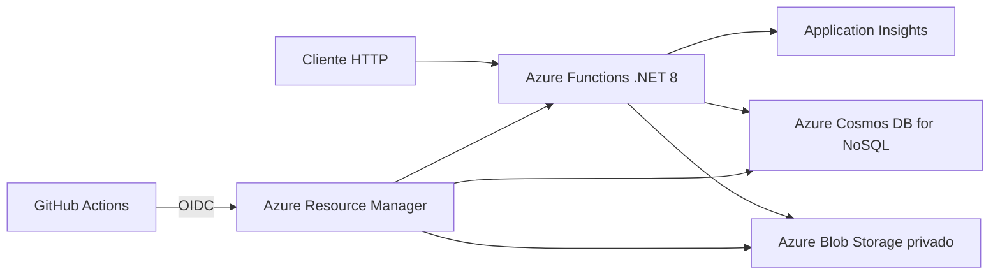

# Stream Catalog Functions

API serverless original em **.NET 8 e Azure Functions** para gerenciar um catálogo de filmes e séries. O projeto foi criado para o desafio da DIO **Criando um Gerenciador de Catálogos da Netflix com Azure Functions e Banco de Dados**, sem copiar o código do instrutor ou de terceiros.

> **Transparência:** esta solução não é afiliada à Netflix. O Azure não foi implantado durante o desenvolvimento porque não foi utilizada uma assinatura. A infraestrutura, os scripts e o workflow de deploy estão preparados para uma assinatura válida, sem afirmar a existência de recursos ou URL pública.

## Objetivo

Demonstrar uma arquitetura serverless capaz de:

- receber capas em JPEG, PNG ou WEBP;
- armazenar arquivos privados no Azure Blob Storage;
- cadastrar metadados de filmes e séries no Azure Cosmos DB for NoSQL;
- listar, paginar, pesquisar e consultar itens do catálogo;
- disponibilizar contrato OpenAPI e endpoint de saúde;
- provisionar a infraestrutura com Bicep;
- validar e publicar a Function App com GitHub Actions e Azure OIDC.

## Arquitetura



No Azure, a Function App usa uma **identidade gerenciada** com acesso de dados ao Blob Storage e ao Cosmos DB. Nenhuma chave desses serviços é mantida no código ou no workflow.

## Funções HTTP

| Método | Rota | Autorização no Azure | Finalidade |
| --- | --- | --- | --- |
| `GET` | `/api/v1` | Anônima | Metadados da API |
| `GET` | `/api/v1/openapi` | Anônima | Contrato OpenAPI em YAML |
| `GET` | `/api/v1/health` | Anônima | Estado e provedores configurados |
| `POST` | `/api/v1/covers?fileName=...` | Function key | Enviar uma capa de até 5 MiB |
| `GET` | `/api/v1/covers/{fileName}` | Anônima | Baixar uma capa privada através da API |
| `POST` | `/api/v1/catalog` | Function key | Cadastrar filme ou série |
| `GET` | `/api/v1/catalog` | Anônima | Listar e paginar o catálogo |
| `GET` | `/api/v1/catalog/search` | Anônima | Filtrar por título, gênero, tipo ou ano |
| `GET` | `/api/v1/catalog/items/{id}` | Anônima | Consultar um item |

O contrato completo, incluindo exemplos e respostas de erro, está em [`openapi.yaml`](openapi.yaml).

## Tecnologias

- .NET 8 e C#;
- Azure Functions v4 no modelo isolated worker;
- Azure Blob Storage;
- Azure Cosmos DB for NoSQL;
- Azure Identity e identidade gerenciada;
- OpenTelemetry e Application Insights;
- Bicep;
- xUnit v3 e Coverlet;
- GitHub Actions com autenticação OpenID Connect;
- Azurite para armazenamento local.

## Executar localmente

### Pré-requisitos

- SDK do .NET 8;
- Azure Functions Core Tools v4;
- Azurite 3.37 ou Docker para executar o emulador.

### 1. Iniciar o Azurite

Com Docker:

```bash
docker compose up -d
```

Ou com Node.js:

```bash
npx azurite@3.37.0 \
  --silent \
  --skipApiVersionCheck \
  --location .azurite
```

### 2. Criar a configuração local

Linux ou macOS:

```bash
cp src/StreamCatalog.Functions/local.settings.json.example \
  src/StreamCatalog.Functions/local.settings.json
```

PowerShell:

```powershell
Copy-Item src/StreamCatalog.Functions/local.settings.json.example `
  src/StreamCatalog.Functions/local.settings.json
```

A configuração de exemplo usa o **Azurite para as capas** e um repositório **em memória para o catálogo**. Portanto, os metadados locais são apagados quando o processo termina. No Azure, o provedor configurado pelo Bicep é o Cosmos DB.

### 3. Iniciar a Function App

```bash
cd src/StreamCatalog.Functions
func start
```

A API ficará disponível em `http://localhost:7071/api/v1`.

## Exemplo de uso

### Enviar uma capa

```bash
curl -i -X POST \
  "http://localhost:7071/api/v1/covers?fileName=arrival.png" \
  -H "Content-Type: image/png" \
  --data-binary "@arrival.png"
```

Copie o `fileName` gerado na resposta e utilize-o no cadastro:

```bash
curl -i -X POST http://localhost:7071/api/v1/catalog \
  -H "Content-Type: application/json" \
  -d '{
    "title": "Arrival",
    "synopsis": "A linguist works with visitors from another world.",
    "type": "movie",
    "genres": ["Science Fiction", "Drama"],
    "releaseYear": 2016,
    "ageRating": "12",
    "coverFileName": "IDENTIFICADOR-GERADO.png"
  }'
```

Pesquisar o catálogo:

```bash
curl "http://localhost:7071/api/v1/catalog/search?genre=Science%20Fiction&type=movie"
```

A autenticação de Functions é desabilitada pelo host local. Depois do deploy, envie a chave no cabeçalho `x-functions-key` nas operações `POST`.

Outras requisições estão em [`docs/requests.http`](docs/requests.http).

Com o host e o Azurite em execução, rode também o smoke test reproduzível:

```bash
python3 scripts/smoke-test.py
```

Para outro host, defina `STREAM_CATALOG_BASE_URL`. No Azure, defina também `STREAM_CATALOG_FUNCTION_KEY` sem gravar a chave em arquivo.

## Build e testes

```bash
dotnet restore --locked-mode
dotnet format --verify-no-changes --no-restore
dotnet build --configuration Release --no-restore
dotnet test \
  --configuration Release \
  --no-build \
  --settings coverage.runsettings \
  --collect "XPlat Code Coverage" \
  --results-directory TestResults
```

Resultados medidos na revisão final:

- **80 testes aprovados**;
- **100% de cobertura de linhas e 100% de branches** no escopo unitário configurado;
- build com **0 erros e 0 avisos**;
- smoke test no host real com Azurite: **23/23 grupos aprovados**;
- nenhuma dependência NuGet vulnerável ou obsoleta identificada.

A cobertura exclui código gerado pelo SDK, o ponto de entrada e os adaptadores que exigem serviços Azure reais. Serviços, validações, contratos, funções HTTP, serialização, paginação, repositórios em memória e configuração de dependências permanecem no escopo. Consulte [`docs/VALIDACAO.md`](docs/VALIDACAO.md).

## Infraestrutura Azure

O arquivo [`infra/main.bicep`](infra/main.bicep) declara:

- Storage Account com acesso público de blobs desabilitado;
- container privado `covers`;
- Cosmos DB serverless, banco `stream-catalog` e container `items`;
- plano Consumption Linux;
- Function App .NET isolated;
- Log Analytics e Application Insights;
- identidade gerenciada e permissões de dados mínimas necessárias.

Implantação manual, caso exista uma assinatura:

```bash
bash scripts/deploy-azure.sh
```

A criação dos recursos pode gerar cobrança. Leia [`docs/DEPLOY-AZURE.md`](docs/DEPLOY-AZURE.md) antes de executar qualquer comando e use o script de exclusão ao terminar.

## CI/CD

- **CI:** restauração bloqueada, formatação, build, 80 testes, limite mínimo de cobertura, publicação da Function App e compilação do Bicep.
- **Deploy:** workflow exclusivamente manual, autenticação Azure por OIDC, provisionamento por Bicep, publicação do pacote e verificação de saúde.

O workflow de deploy não executa automaticamente em `push` e exige credenciais federadas válidas.

## Estrutura

```text
stream-catalog-functions/
├── .github/workflows/          # CI e deploy manual
├── docs/                       # arquitetura, Azure, evidências e exemplos
├── infra/main.bicep            # infraestrutura como código
├── scripts/                    # deploy, exclusão segura e cobertura
├── src/StreamCatalog.Functions/
│   ├── Application/            # regras de negócio e validações
│   ├── Contracts/              # contratos HTTP
│   ├── Domain/                 # entidades e enums
│   ├── Functions/              # nove Azure Functions HTTP
│   ├── Infrastructure/         # DI, identidade e serialização Cosmos
│   ├── Repositories/           # memória, Blob Storage e Cosmos DB
│   └── Serialization/          # JSON estrito
├── tests/StreamCatalog.Functions.Tests/
├── compose.yaml
├── coverage.runsettings
├── openapi.yaml
└── StreamCatalog.sln
```

## Decisões e limitações

- a implementação é original e usa nomes, rotas e organização próprios;
- capas permanecem privadas e são servidas pela Function App;
- o catálogo local em memória existe somente para desenvolvimento e testes;
- o ambiente Azure usa persistência no Cosmos DB;
- arquivos são limitados a 5 MiB e três formatos de imagem;
- não há interface gráfica: o foco do desafio é o backend serverless;
- não houve deploy remoto durante a elaboração por ausência de assinatura Azure.

## Referências oficiais

- [Azure Functions .NET isolated worker](https://learn.microsoft.com/azure/azure-functions/dotnet-isolated-process-guide)
- [Azure Blob Storage para .NET](https://learn.microsoft.com/azure/storage/blobs/storage-quickstart-blobs-dotnet)
- [Azure Cosmos DB for NoSQL para .NET](https://learn.microsoft.com/azure/cosmos-db/nosql/quickstart-dotnet)
- [Autenticação OIDC no Azure Login](https://github.com/Azure/login#login-with-openid-connect-oidc-recommended)
- [Documentação do Bicep](https://learn.microsoft.com/azure/azure-resource-manager/bicep/)

## Licença

Distribuído sob a licença MIT. Consulte [`LICENSE`](LICENSE).
